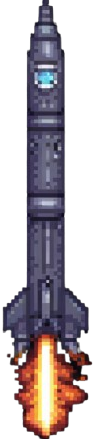

# Meteor-Mayhem---gamification
## Test 1 - 12-12-2024
### Notes
#### Theoretical Framework

In Python, this code snippet defines a special method called __init __ within a class. This method has a very specific function: to initialize the objects of that class.

**def**: *Indicates the beginning of a function definition in Python.*

**__init__**: *Is a magic or dunder (double underscore) method that is automatically executed when a new instance of a class is created (that is, when a new object is created).*

**self**: *Is a reference to the object that is being created. It is used to access the attributes and methods of the object.*

**x and y**: *Are parameters that are passed to the init method when an object is created. These parameters are used to initialize the attributes of the object.*

```
import pygame  
    # The Pygame library is imported to import the video game objects. 
    # In this case this object will be the spaceship and will have x, y as parameters. These belong to the argument of the 
    # method/function __init__.

class Cubo:
    def __init__(self,x,y):
        self.x = x
        self.y = y
        self.ancho = 50
        self.alto = 50
        self.velocidad = 10
        self.color = "red"
        self.rect = pygame.Rect(self.x, self.y, self.alto, self.alto)
        
    def dibujar(self,ventana):
        pygame.draw.rect(ventana, self.color, self.rect)
        self.rect = pygame.Rect(self.x, self.y, self.alto, self.alto)
```
### Class Diagram Example in Python


## Test 2 - 13-12-2024
### Notes


## Test 3 - 14-12-2024
### Notes

#### 7.1 [colliderect] es una Función del modulo de rectángulo del modulo pygame se encarga de reconocer choques de instancias de objetos. Con este condicional podemos realizar diversas acciones.

#### 7.2 Accede al bucle de enemigos y elimina al enemigo en caso de que SI haya una colisión.

```
if pygame.Rect.colliderect(cubo.rect, enemigo.rect):
print ("COLLISION!!!")                                      #7.1             
vida -= 1                         
print (f"TE HAN QUITADO UNA VIDA, TE QUEDAN {vida} vidas")   
# Siguiente Linea de codigo:
enemigos.remove(enemigo)                                    #7.2
```
#### 7.3 El bucle del juego funcionara SI tenemos mas de 0 vidas
```
while jugando and vida > 0:
```
### Grafico:


## Test 4 - 15-12-2024
### Notes

#### 8.1 Importante para el proceso siguiente
```
pygame.init()   #8.1
```
#### 8.2 Se crea la constante de fuente con el modulo [font] de Pygame que nos permitira por medio de una funcion con dos parametros tienen como argumento el nombre de la fuente y su numero.
```
FUENTE = pygame.font.SysFont("Blox BRK", 48)  #8.2
```
#### 8.3 Almacenar en una variable para renderizar texto con nuestra conestante y el metodo render.
```
texto_nombre = FUENTE.render("Meteor Mayhem", True, "White")
texto_vida = FUENTE.render(f"LIFE {vida}", True, "White")      #8.3
texto_puntos = FUENTE.render(f"PUNTOS {puntos}", True, "White")
```
#### 8.4 [blit] sirve como funcion que mostrara en la ventana del juego la instacia del texto, como argumento tiene la instancia de vida y las coordenadas de posicion del texto en la pantalla. 
```
VENTANA.blit(texto_vida, (1120,10))          #8.4
VENTANA.blit(texto_nombre, (1000/2,10))
VENTANA.blit(texto_puntos, (10,10))
``` 
### Grafico:


## Test 5 - 16-12-2024
### Notes

Para darle logica a la suma de puntos debemos crear una condicional que incluya la variable "puntos" donde
los puntos suban bajo alguna logica. En este periodo se implemento que al momento de salir enemigos de la ventana se sube un punto.

#### 9.1 Si la posicion del enemigo es mayor al alto de la ventana.
##### 9.1.1 nos suma puntos.
##### 9.1.2 En lo que se elmine/desaparezca un enemigo nos suma un punto.

```
if enemigo.y + enemigo.alto > ALTO: #9.1
    puntos += 1   #9.1.1
    enemigos.remove(enemigo) #9.1.2
```

### 10 - Creacion de clases de balas.
Crearemos un objeto/clase que sera la bala, mas pequena, lenta y de otro color a los otros objetos.
Esta objeto se disparara desde nuestro cubo.

Para disparar este objeto, necesitaremos:
- 10.1 Clase de las balas;
- 10.2 Una lista de balas;
- 10.3 Una funcion para crearlas/dispararlas;
- 10.4 Darle una tecla a las balas para ser disparadas;
- 10.5 Un bucle donde dibujarlas en la ventana del juego.

### 10.1 Clase de las balas

#### 10.1.1 Se crea el objeto, la clase bala, con los argumentos de posicion x,y, y el resto de atributos (self).
#### 10.1.2 El ancho y el alto de las balas es mas pequeno que los anteriores objetos.
#### 10.1.3 Se resta el eje vertical (self.y) con la velocidad para que la bala vaya hacia arriba.

```
class Bala:                       #10.1.1
    def __init__(self,x,y):
        self.x = x
        self.y = y
        self.ancho = 20
        self.alto = 20            #10.1.2
        self.velocidad = 10
        self.color = "white"
        self.rect = pygame.Rect(self.x, self.y, self.alto, self.alto)
        
    def dibujar(self,ventana):
        pygame.draw.rect(ventana, self.color, self.rect)
        self.rect = pygame.Rect(self.x, self.y, self.alto, self.alto)

    def movimiento(self):
        self.y -= self.velocidad  #10.1.3
```
### Class Diagram Example in Python


### 10.2 Lista de balas

#### 10.2.1 Creamos una variable que contenga una lista de balas.
```
balas = [] #10.2.1
```
### 10.3 Una funcion para crearlas;

#### 10.3.1 Creamos una funcion para disparar balas.
#### 10.3.2 Nuestra lista de balas usara el metodo append para almacenar el argumento de posicion de la clase bala que en este caso sera el centro de los dos ejes de posicion del cubo.
```
def crear_bala():                                               #10.3.1
    balas.append(Bala(cubo.rect.centerx,cubo.rect.centery))     #10.3.2
```
### 10.4 Darle una tecla a las balas para ser disparadas;

#### 10.4.1 Asignamos la tecla espacio para ejecutar nuestra funcion [crear_bala]. Esto dentro de nuestra funcion de gestionar teclas con el parametro teclas [gestionar_teclas(teclas)].
```
if teclas[pygame.K_SPACE]:
crear_bala()                    #10.4.1
```
### 10.5 Un bucle donde dibujarlas en la ventana del juego.

#### 10.5.1 Creamos un bucle para generar las balas.
#### 10.5.2 Y las dibujamos en la ventana del juego.
```
for bala in balas:          #10.5.1
    bala.dibujar(VENTANA)   #10.5.2
    bala.movimiento()
```
### Grafico:


## Test 6 - 20-12-2024
### Notes

#### 11.1 Tiempo de recarga de las balas. 

##### 11.1.1 Utilizamos un global para acceder a la variable de ultima bala.
##### 11.1.2 Si el tiempo de juego menos la ultima bala, es mayor que el tiempo entre milisegundos entonces:
##### 11.2.3 La ultima bala en esta funcion pasa a valer el numero de milisegundos desde que inicio el juego. 
```
    global ultima_bala                                             #11.1.1
    if pygame.time.get_ticks() - ultima_bala > tiempo_entre_balas: #11.1.2
        balas.append(Bala(cubo.rect.centerx,cubo.rect.centery)) 
        ultima_bala = pygame.time.get_ticks()                      #11.1.3    
```
#### 11.2 Logica de colision de las balas con los enemigos:
```
    for bala in balas:
        if pygame.Rect.colliderect(bala.rect, enemigo.rect):
            enemigos.remove(enemigo)
            balas.remove(bala)
            puntos += 1
```
### Grafico:
https://github.com/user-attachments/assets/384e7d4a-29f2-4f06-b068-d629e3a8dd1c

## Test 7 - 28-12-2024
### Notes

#### 12.1 Vida de los enemigos.

##### 12.1.1 En el bucle de balas hay una condicion de que si en caso de colision tendremos una vida extra.
```
puntos += 1                                     #12.1.1
```
##### 12.1.2 Se creara otro atributo en la clase de [Enemigos] donde se almacenara la cantidad de vidas.
```
class Enemigos:
    def __init__(self,x,y):
        self.x = x
        self.y = y
        self.ancho = 50
        self.alto = 50
        self.velocidad = 5
        self.color = "purple"
        self.rect = pygame.Rect(self.x, self.y, self.alto, self.alto)
        self.vida = 3                           #12.1.2
```
##### 12.1.3 Se elimina la linea que elimina enemigos con solo la colision.
##### 12.1.4 En esta linea se le restara una unidad de vida a cada enemigo al momento de una colision.
```
for bala in balas:
    if pygame.Rect.colliderect(bala.rect, enemigo.rect):
        ~~enemigos.remove(enemigo)~~        #12.1.3
        enemigo.vida -= 1                   #12.1.4
        balas.remove(bala)
        puntos += 1
```
##### 12.1.5 Dentro del bucle de balas crearemos la condicion de que si la vida del enemigo es menor o igual a cero. Se eliminara el enemigo.
```
if enemigo.vida <= 0:                       #12.1.5
    enemigos.remove(enemigo)
```
#### 12.2 Eliminando un bug en la condicion de caida de los enemigos.
##### 12.2.1 Se elimina el alto de la pantalla y que se elimine cuando baje completamente el eje "y" del objeto.
```
if enemigo.y > ALTO:
    enemigos.remove(enemigo)                #12.2.1 
```
### Grafico:
https://github.com/user-attachments/assets/c80efe6b-a7b1-48ba-8f90-69bd9d249315

## Test 8 - 29-12-2024
### Notes

#### 13.1 Puntuaciones.
##### 13.1.1 Cerramos la pantalla del videojuego con la funcion quit del modulo pygame.
```
pygame.quit() #13.1.1
```
##### 13.1.2 Hacemos una variable que almacenara un input tipo cadena que almacenara una cadena de texto que exigira tu nombre.
##### 13.1.3 Creamos un archivo para almacenar los datos de las puntuaciones. con la funcion open que tendra como primer argumento el nombre del archivo y segundo argumento la ['a'] que significa append. Esta funcion se almacenara en una variable llamada archivo.
- Si colocamos['w'] se escribe y se elimina la puntuacion anterior. 
- Si colocamos ['r'] simplemente lee.
##### 13.1.4 Accederemos a la variable archivo donde se va a escribir mediante el metodo write que guardara las cadenas almacenadas en el variable nombre y los puntos obtenidos durante la ultima partida.
```
nombre = input("Introduce tu nombre: ") #13.1.2
with open('puntuaciones.txt', 'a') as archivo:  #13.1.3
archivo.write(f"{nombre} - {puntos}\n") #13.1.4
```
### Grafico:
https://github.com/user-attachments/assets/5746322a-13a3-4438-8ca0-9cca873b5a8e

## Test 9 - 30-12-2024
### Notes

#### 13.1 Imagenes de personajes.

##### 13.1.1 Creamos un atributo por medio del parametro self, ese atributo almacenara el modulo [pygame] que accedera al modulo [image] que usara la funcion [load] que tendra como argumento una cadena de texto con la direccion especifica del archivo de imagen que es para usar/sustituir el objeto.

#### 13.1.1.1 Imagen del personaje:


#### 13.1.1.2 Imagen del Enemigo:


#### 13.1.1.3 Imagen de la Bala:


##### 13.1.2 Usamos el mismo atributo que que por medio del modulo [transform] de la libreria [pygame] usaremos la funcion [scale] que tendra como argumentos, el atributo de imagen como primer argumento y las dimensiones del objeto como segundo argumento para ajustar la imagen al objeto.

###### 13.1.3 Ahora debemos dibujar las imagenes sobre los objetos, asì que utilizaremos nuestra variable ventana usando el metodo/la funcion [blit] con el atributo de nuestra imagen como primer argumento y los ejes de posicion del objeto como segundo argumento.

###### 13.1.4 Ahora al iniciar simplemente debemos ocultar los dibujos de nuestros rectangulos para que solo se vean las imagenes.
```
class Cubo:
    def __init__(self,x,y):
        self.x = x
        self.y = y
        self.ancho = 80
        self.alto = 80
        self.velocidad = 10
        self.color = "red"
        self.rect = pygame.Rect(self.x, self.y, self.alto, self.alto)
        self.imagen = pygame.image.load("./resources/personaje.png") #13.1.1
        self.imagen = pygame.transform.scale(self.imagen, (self.ancho,self.alto)) #13.1.2  
  
    def dibujar(self,ventana):
        #pygame.draw.rect(ventana, self.color, self.rect) #13.1.4
        self.rect = pygame.Rect(self.x, self.y, self.alto, self.alto)
        ventana.blit(self.imagen,(self.x,self.y)) #13.1.3
```
##### Nota, esto se hara con todas las clases de los objetos.

<div style="text-align: center;">
  <div style="display: inline-block; width: 33%;">
    
  </div>
  <div style="display: inline-block; width: 33%;">
    
  </div>
  <div style="display: inline-block; width: 33%;">
    
  </div>
  <div style="clear: both;"></div>
</div>